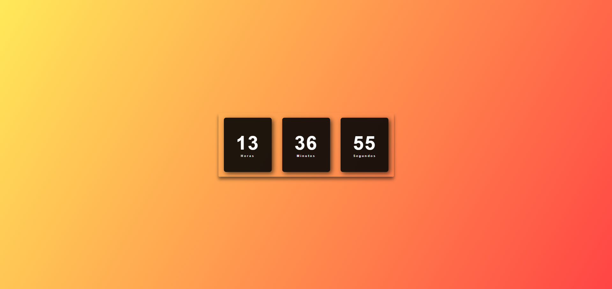

# 🕒 Relógio Digital

Um relógio digital simples feito com **HTML**, **CSS** e **JavaScript**, exibindo as horas, minutos e segundos em tempo real.

## 📸 Preview

 <!-- Você pode substituir por uma imagem real do seu projeto -->

## 🔧 Funcionalidades

- Exibição do horário atual (horas, minutos e segundos).
- Estilo visual moderno com fundo degradê.

Projeto desenvolvido por Irwayne Taborda.

